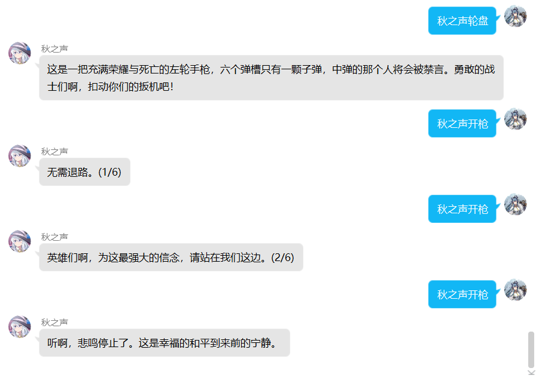

# mirai-roulette

一个基于 [mirai](https://github.com/mamoe/mirai) 的俄罗斯轮盘插件

灵感以及默认语录来源[Pallas-Bot: 《明日方舟》帕拉斯 Bot](https://github.com/InvoluteHell/Pallas-Bot)

## 使用方法

按照 [Mirai 用户手册](https://github.com/mamoe/mirai/blob/dev/docs/UserManual.md) 安装完插件后即可开始使用

使用 机器人昵称 + 轮盘 来开始一轮轮盘

在末尾带上数字可以选择填装的子弹数

使用 机器人昵称 + 开枪 来开枪

使用 机器人昵称 + `模式` + 轮盘 来切换模式，目前有`禁言`和`踢人`两种模式

会随机抽取一个幸运儿进行1-20分钟的禁言（需要管理员权限，否则则会发送示例中的消息）

示例：

## 自定义配置

可以通过修改config/per.autumn.mirai.roulette/roulette.yml来配置

### 字段解释

`botName`：可用于替代机器人的昵称，留空以使用机器人昵称（实际上使用的是群名片，但似乎只能获取昵称）

`quotations`：机器人回复的语录，如果第一次使用或配置不对将会替换成默认的

前5句是未打中时的回复，第6句是轮盘介绍，其中"$1"为当前子弹数 "$2"为当前模式，会自动替换

第7句是手枪卡壳的回答（有5%的概率开枪失败），第8句是打中时的回答，第9句是没有权限时的回答

后4句语录中的`@`会被默认替换为@发送者
